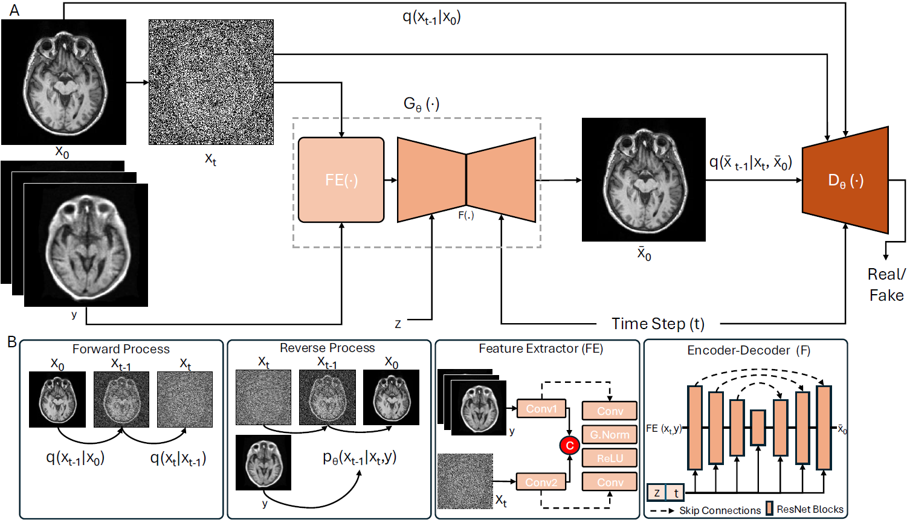

# GenAI empowers point-of-care MRI: high-fidelity synthetic imaging with multi-site validation
This repo contains the official Pytorch implementation for SynPoC Model.


**Environment**  <br />  <br />
Please prepare an environment with python>=3.8, and then run the command "pip install -r requirements.txt" for the dependencies.

**Data Preparation**  <br />  <br />
For experiments, extract 2D axial slices from 3D MR images, save them as a .npy file using [data_process.py](data_process.py) and prepare the dataset folder structure as follows.
```
data/
├── dataset_1/
│   ├── train/
│   │   ├── lf_data.npy
│   │   └── hf_data.npy
│   ├── test/
│   │   ├── lf_data.npy
│   │   └── hf_data.npy
│   ├── val/
│   │   ├── lf_data.npy
│   │   └── hf_data.npy

```
**Train SynPoC** <br />  <br />
Update input_path, output_path and in train_synpoc.py.
```
python train_synpoc.py --image_size 256 --exp exp_synpoc --num_channels 1 --num_channels_dae 64 --ch_mult 1 1 2 2 4 4 --num_timesteps 4 --num_res_blocks 2 --batch_size 1 --num_epoch 2 --ngf 64 --embedding_type positional --ema_decay 0.999 --r1_gamma 1. --z_emb_dim 256 --lr_d 1e-4 --lr_g 1.6e-4 --lazy_reg 10 --num_process_per_node 1

```

**Test SynPoC** <br />  <br />
Update input_path and output_path in below cmd accordingly
```
python test_synpoc.py --image_size 256 --exp exp_synpoc --num_channels 1 --num_channels_dae 64 --ch_mult 1 1 2 2 4 4 --num_timesteps 4 --num_res_blocks 2 --batch_size 1 --embedding_type positional  --z_emb_dim 256  --which_epoch 0 --gpu_chose 0 --input_path '/synpoc/data/' --output_path '/synpoc/results' 
```
**Acknowledgements**  <br />  <br />
This repository makes liberal use of code from [Tackling the Generative Learning Trilemma](https://github.com/NVlabs/denoising-diffusion-gan) and [SynDiff](https://github.com/icon-lab/SynDiff).
